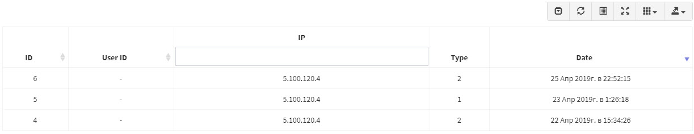

# Documentation for phalcon-data-table

[bootstrap-table documentation](https://bootstrap-table.com/docs/getting-started/introduction/)

## class constructor
```php
$creator $creator = new MySqlCreater($model, $configuration)
```
`$model` - \Phalcon\Mvc\Model [link1](https://docs.phalconphp.com/4.0/en/api/phalcon_mvc_model) 
[link2](https://docs.phalconphp.com/4.0/en/db-models)

`$configuration` - configuration array

### configuration array

`'columns'` [array|string]  - columns access (required)

```php
// for string
$config['columns'] = "id,usersId,ipAddress,type,createdAt";
// for array
$config['columns'] = ["id","usersId","ipAddress","type","createdAt"];
```
---
`'s_columns'` [array|string]  - columns access. If no 's_columns' in config, filters off. Filters info: [bootstrap-table select2 filter](https://bootstrap-table.com/docs/extensions/select2-filter/)

Used to create a query by type "column1 LIKE :bind_param1: AND column2 LIKE :bind_param2:", which allows the use of % and _ in the query

```php
// for string
$config['s_columns'] = "ipAddress,type";
// for array
$config['s_columns'] = ["ipAddress","type"];
```
---
`'search_column'` [string]  - column for search ('%'.value.'%').
If no 'search_column' in config, search off.
([link](https://bootstrap-table.com/docs/api/table-options/#search))

```php
$config['search_column'] = "ipAddress";
```
---
`'conditions'` [array]  - conditions (Can't be used without 'bind').

`'bind'` [array]  - bind values for conditions (Can not be used without 'conditions')

```php
$config['conditions'] = ['usersId = :user_id:'];
$config['bind']       = ['user_id' => $user->id];
```
---
`'data'` [array]  - request for bootstrap table (required)

```php
$config['data'] = $this->request->getPost();
```
---
`'max_rows'` [array]  - maximum rows of query (limit). 
To protect against receiving large amounts of data from the database on the server side.

```php
$config['max_rows'] = 1000;
```

### Simple
**php**
```php
$model   = new ResetPasswords();

$creator = new MySqlCreater($model, [
    'columns'    => 'id,usersId,ipAddress,type,createdAt',
    's_columns'  => 'ipAddress',
    'conditions' => ['usersId = :user_id_con:'],
    'bind'       => ['user_id_con' => $user->id],
    'data'       => $this->request->getPost(),
]);

return $this->response->setJsonContent($creator->getResult());
```
**html**
```html
<table
        id="table-reset-passwords"
        class="table table-hover"
        data-toolbar="#toolbar"
        data-show-refresh="true"
        data-show-toggle="true"
        data-show-fullscreen="true"
        data-show-columns="true"
        data-show-export="true"
        data-minimum-count-columns="1"
        data-show-pagination-switch="true"
        data-pagination="true"
        data-id-field="id"
        data-sort-name="createdAt"
        data-sort-order="desc"
        data-page-list="[5, 10, 25]"
        data-side-pagination="server"
        data-url="/admin/users/api/reset-passwords/get/{{ USER.id }}"
        data-method="POST"
        data-content-type="application/x-www-form-urlencoded">
</table>
```
**javascript**
```javascript
$('#table-reset-passwords').bootstrapTable('destroy').bootstrapTable({
    locale : 'ru-RU',
    filter : true,
    columns: [
            {
                field    : 'id',
                title    : 'ID',
                sortable : true,
                align    : 'center',
            },
            {
                field    : 'userId',
                title    : 'User ID',
                sortable : true,
                align    : 'center',
            },
            {
                field    : 'ipAddress',
                title    : 'IP',
                sortable : false,
                align    : 'center',
                filter: {
                    type:'input'
                },
            }, {
                field    : 'type',
                title    : 'Type',
                sortable : false,
                align    : 'center'
            }, {
                field    : 'createdAt',
                title    : 'Date',
                sortable : true,
                align    : 'center',
                formatter: unixTimeFormater,
            }, 
        ],
});
```
